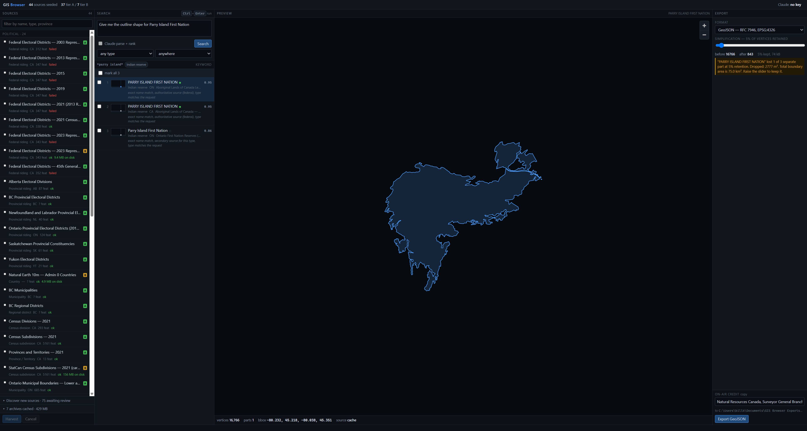
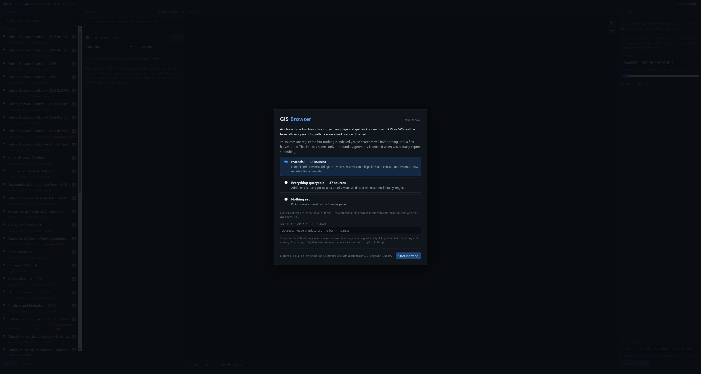
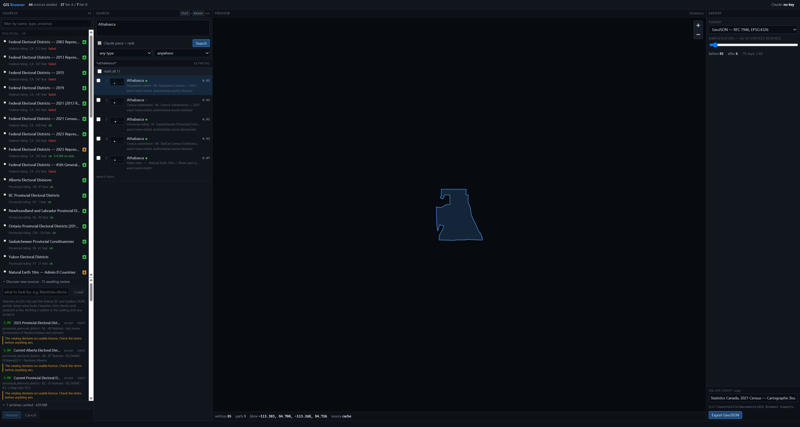
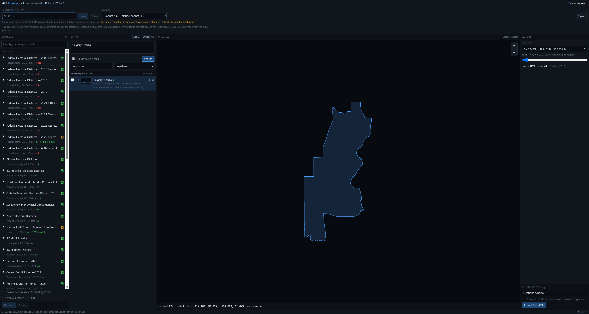
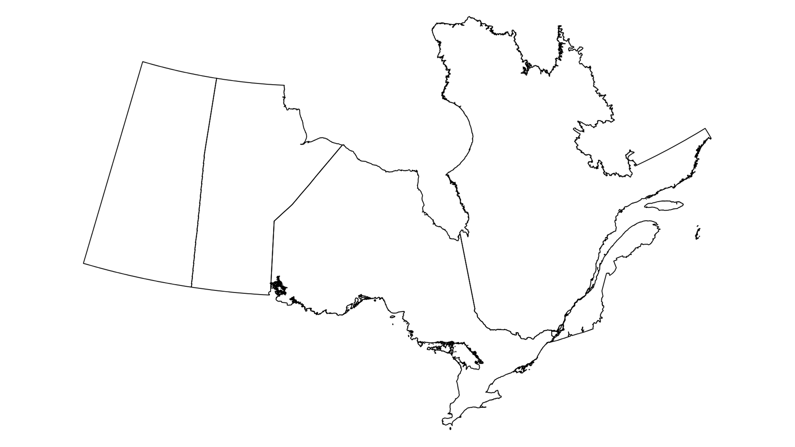

# GIS Browser

[](https://github.com/ShinobiFPV/gis-browser/actions/workflows/build.yml)
[](LICENSE)

Ask for a boundary in plain language. Get back a clean GeoJSON or SVG outline from
official open data, with its source, licence and vintage attached.

Built for broadcast graphics — the case it is shaped around is an artist on deadline who
needs the outline of a federal riding, a First Nation reserve, a census subdivision, a US
state or a country, and needs it to be *right*, because a wrong boundary on air costs far
more than a click.

Canada is covered in depth. Every country on earth and all 56 US states and equivalents
are covered as of v0.2.0; other countries get the same treatment one at a time.



---

## The problem

Canadian boundary data is all published openly, and almost none of it is easy to get.
It is spread across Statistics Canada, Elections Canada, NRCan, thirteen provincial
portals, ArcGIS Hubs and CKAN instances. Each uses a different API, a different
projection, a different idea of what a field should be called, and its own name for the
same place. Finding "Parry Island First Nation" means knowing it is filed as
*Parry Island 16* in one source and *Wasauksing* in conversation.

GIS Browser indexes all of it by name, then fetches only the geometry you actually ask
for. Outside Canada the same problem repeats in a different shape, one publisher at a
time — which is why coverage grows country by country rather than by finding a single
global source and trusting it.

### Jurisdiction codes

Codes are ISO 3166. Countries are two letters (`US`, `FR`); anything inside a country
carries its country (`US-TX`, `CA-ON`).

The prefix is not decoration. Five Canadian abbreviations are also ISO country codes for
somewhere else entirely:

| Code | Was | Is also |
|---|---|---|
| `NL` | Newfoundland and Labrador | Netherlands |
| `NU` | Nunavut | Niue |
| `PE` | Prince Edward Island | Peru |
| `SK` | Saskatchewan | Slovakia |
| `YT` | Yukon | Mayotte |

Sharing one namespace would not have thrown an error — it would have quietly merged them.
A filter for the Netherlands returning Newfoundland's ridings is exactly the failure this
app exists to prevent: no error, plausible output, wrong country.

### Boundaries that cross the antimeridian

Alaska runs from **−179.147° to 179.778°**. Take the minimum and maximum longitude and you
get a bounding box spanning −179 to 179 — a box containing every point on earth. The same
is true of Russia, Fiji, New Zealand, Kiribati and the United States as a whole.

Longitude is therefore measured on a circle, not a line: a set of longitudes has a largest
gap, and the tightest box is the one spanning everything *except* that gap. Alaska comes
out 58° wide instead of 359°, Fiji 7.2°, Russia 171.4°.

Such a box is stored `minx > maxx`, the standard convention. SQLite's R-tree rejects that
outright — the first Alaska harvest died on `rtree constraint failed:
features_rtree.(minx<=maxx)` — so every feature gets two R-tree slots and a crossing
extent is indexed as its two lobes. A query over Attu finds Alaska; a query over London
does not.

## Core architectural decision: index everything, fetch geometry on demand

This drives the whole design. The local database is a **searchable catalog with a geometry
cache**, not an offline mirror of the world.

**Tier A** — queryable services (ESRI FeatureServer, OGC WFS). Harvest names, attributes
and a bounding box. No geometry. When you export a boundary, its geometry is fetched from
the source and cached permanently. The cache warms around whatever your newsroom actually
uses.

**Tier B** — bulk files. There is no per-feature interface, so the only way in is to take
the whole archive. These are explicitly user-triggered, the size is shown before the
download starts, and geometry is stored at index time — so those boundaries export with
no network at all.

A full harvest of the Canadian registry indexes **90,495 features** and **203,482 search
aliases** across 45 sources. Adding every country and all 56 US states puts another 314
features on top of that.

Size is dominated by cached geometry, not by the index. On the development machine the
file is **2.0 GB**, of which the `geometries` table is 2.12 GB and everything else —
features, aliases, the FTS index, the R-tree, every index — comes to about 40 MB.

That split is the architecture working. 67,198 of those cached geometries arrived with
Tier B archives, which have no per-feature interface and must be taken whole. Just **22**
came from Tier A, fetched on demand because somebody actually exported them. Harvest only
Tier A and the catalog stays in the tens of megabytes until you start using it.

---

## Screenshots

### Search → preview → export

Three local matching passes, a map preview, and an export pane that tells you what
simplification actually did before you write the file.


### First run

A fresh install has sources registered but nothing indexed, so it explains itself and
offers a starter harvest. Bulk downloads are excluded from every plan and it says so.



### Source discovery

Crawls ArcGIS Hub and CKAN portals for boundary layers, classifies them, checks each
endpoint is live, and stages them for review. Nothing enters the catalog without you
accepting it — every concern is listed, never collapsed.



### Settings

API key and model, inline. No modal dialogs anywhere in the search-to-export path.



### Example output

Four provinces exported to SVG at 8% retention, in Statistics Canada Lambert. The curved
northern edge is the projection doing its job — unprojected it would be a straight
parallel. Shared borders stay shared.



---

## How search works

Type a request in plain language. It is understood **without any network call**:

1. **Parse** — a keyword parser pulls out the place name, boundary type, jurisdiction and
   vintage. `"Give me the outline shape for Parry Island First Nation"` becomes
   `parry island` + type `indian_reserve`.
2. **Match** — three passes over an SQLite FTS5 index of every name and alias: exact
   phrase, then a looser pass for extra words, then bounded-Levenshtein fuzzy matching
   for typos, prefiltered by trigram.
3. **Rank** — scored on name similarity, source authority for that boundary type, alias
   quality, type and jurisdiction agreement, and vintage.

**The top five are always shown, with map thumbnails. Nothing is ever auto-exported**,
however confident the match.

The jurisdiction filter is built from what the catalog actually holds, grouped by country,
so it can only offer codes that can return something. The model is offered that same list
rather than a fixed enum — there are roughly 250 countries plus every subdivision
harvested under them, and most are not indexed on any given machine.

Adding an API key layers a model over both ends: it parses the request and re-ranks the
candidates. Both are optional and both degrade independently — if the key is missing, the
provider is unreachable, rate-limited, or the reply is malformed, the local resolver
answers and the UI says which provider failed and why. **Geometry is never sent to any
model**, only names, types, sources and a handful of attributes.

### Choosing a provider

The model is a dropdown in Settings, not a build-time decision:

| Provider | Notes |
|---|---|
| **Anthropic (Claude)** | Official SDK. What the app was built and tested against. |
| **OpenAI** | Chat completions with a strict JSON Schema response format. |
| **Google Gemini** | `generateContent`. The key travels in a header, never the URL. |
| **OpenAI-compatible** | Any base URL you point it at — Ollama, LM Studio, vLLM, OpenRouter, Groq, Together, DeepSeek, xAI. |

Keys are stored **one per provider**, each encrypted by the OS, so switching back and
forth does not mean re-entering credentials. A model id can be typed in by hand for any
provider; one that is not in the built-in list simply gets no optional parameters sent and
is validated after the fact, because guessing a capability upward means sending a
parameter the endpoint rejects.

Local models need no key at all, which is the case the OpenAI-compatible option exists for.

## How export works

**GeoJSON** — RFC 7946. WGS 84 lon/lat with no `crs` member at any depth, right-hand-rule
winding (ESRI serves the reverse, so nearly everything needs rewinding), bbox at feature
and collection level, six-decimal coordinates. Every feature carries a `_provenance`
block: source URL, licence, attribution, vintage, retrieval times and exactly what
simplification did. It is written per feature, not per file, so a boundary dragged into
another document keeps its history.

**SVG** — projected through proj4 before fitting to the canvas. One `<g id>` per feature
so Illustrator names the layers, all rings of a feature in a single path with
`fill-rule="evenodd"` so holes stay holes.

**Simplification** — topology-preserving Visvalingam via mapshaper. Every feature in one
export is handed over as a single dataset, so two ridings that share a border share the
same simplified arc. Measured on real data: exporting Ontario, Quebec, Manitoba and
Saskatchewan together, Ontario and Quebec share 484 border vertices *exactly*. Simplified
separately, the two sides diverge and a hairline of background shows through the seam.

The before/after vertex count runs the real simplification rather than estimating, and
anything lost — a dropped island, an enclave, generalisation the source applied — is
reported with its size, so you can judge whether to care.

---

## Getting started

### Install

From [Releases](../../releases):

| Platform | File |
|---|---|
| Windows x64 | `GIS.Browser-0.2.0-setup.exe` |
| macOS Apple silicon | `GIS.Browser-0.2.0-arm64.dmg` |
| macOS Intel | `GIS.Browser-0.2.0-x64.dmg` |

(GitHub replaces the space in the product name with a dot when it stores an asset, so the
file you download is `GIS.Browser-…`, not `GIS Browser-…`.)

**Both builds are unsigned**, and the two platforms handle that differently.

*Windows* — SmartScreen warns on first run until the installer builds reputation. Choose
*More info → Run anyway*.

*macOS* — Gatekeeper is stricter. A downloaded unsigned app is quarantined, and macOS
reports that it **"is damaged and can't be opened"**, which is misleading: the app is
fine, it simply is not notarized. After dragging it to Applications, clear the quarantine
attribute:

```bash
xattr -dr com.apple.quarantine "/Applications/GIS Browser.app"
```

Signing and notarizing both require certificates this project does not have.

On first launch the wizard offers a starter harvest. The essential set (~22 sources —
ridings, provinces, reserves, municipalities, census subdivisions) takes a few minutes.
Bulk downloads are never started for you.

The two international layers are registered but not harvested by default, for the same
reason. US states is Tier A and takes seconds; the countries layer is a 4.9 MB Tier B
archive. Both are in the Sources pane, or from the CLI:

```bash
electron out/main/cli.js --type country              # every country — 258 features, ~1s
electron out/main/cli.js --type province_territory   # 56 US states, plus Canada's 13
```

The second also re-harvests the Canadian provinces layer, which takes about two minutes
against Statistics Canada; the US states themselves take under two seconds.

**Upgrading from 0.1.x rewrites your jurisdiction codes** (`ON` → `CA-ON`) the first time
0.2.0 opens the catalog. It is one-way: a 0.2.0 catalog opened by an older build would
read the prefixed codes as unknown and seed bare ones over them. Verified on a 2.0 GB
catalog — 90,495 features preserved exactly, in under three seconds — but if yours took
hours to harvest, copy the `.sqlite` file first.

### Updates

The app checks GitHub for a newer release on startup — at most once every six hours — and
shows a dismissible banner if one exists. It **checks only**: nothing is downloaded or
installed automatically, because auto-installing requires code signing and macOS refuses
an unsigned update outright. Installing stays the same manual step it was the first time.

The check sends nothing about you and nothing about your catalog, and it can be switched
off in Settings. `--check-updates` runs it from the CLI.

### Build from source

Requires Node 20+. Each installer must be built on its own platform — electron-builder
rebuilds the native module against the host, so there is no cross-compiling here.

```bash
npm install          # postinstall rebuilds better-sqlite3 for Electron
npm run dev          # run in development
npm test             # 510 tests
npm run typecheck    # strict TypeScript, all three tsconfigs
npm run lint         # eslint, zero warnings allowed
npm run dist:win     # NSIS installer into release/  (on Windows)
npm run dist:mac     # arm64 + x64 disk images into release/  (on macOS)
npm run icon         # regenerate the app and PWA icons (pure Node, no image toolchain)
```

The mobile PWA is built separately — see [Mobile](#mobile-the-same-catalog-on-a-phone).

### Continuous integration

[`.github/workflows/build.yml`](.github/workflows/build.yml) runs typecheck, lint and the
full test suite on Linux, then builds the Windows installer and the macOS disk images in
parallel and **smoke-tests each packaged binary** — `--smoke` opens the catalog, runs every
migration, seeds the registry and exits, without ever creating a window.

That last step is the one that matters. Packaging can silently break exactly one thing:
better-sqlite3 is a native module and has to be unpacked from the asar to load. A broken
unpack builds cleanly, installs cleanly, and then dies on the first query. Running the
packaged binary is the only way to catch it.

It also asserts the exact number of native binaries that survived packaging — one on
Windows, two on macOS — because the builder config strips the prebuilds for other
platforms and an over-matching filter would remove SQLite entirely.

Every push to `main` uploads installer artefacts. Pushing a `v*` tag publishes a release.

### Headless CLI

Everything the UI does can be driven from a terminal, which is how most of this was
verified:

```bash
electron out/main/cli.js --list                              # the source registry
electron out/main/cli.js --id 12                             # harvest one source
electron out/main/cli.js --find "Parry Island First Nation"  # search + fetch geometry
electron out/main/cli.js --find "Alaska"                     # states and countries too
electron out/main/cli.js --find "Nunavut" --export svg --retention 5
electron out/main/cli.js --feature 3623 --feature 3624 --export geojson
electron out/main/cli.js --discover "Manitoba electoral divisions"
electron out/main/cli.js --candidates                        # review what discovery found
electron out/main/cli.js --check-updates                     # ask GitHub for the latest release

npm run inspect                                              # catalog invariants
```

---

## Mobile: the same catalog on a phone

An installable PWA that searches the same catalog and exports the same files, for the case
the desktop app cannot cover — an artist away from the workstation who needs a boundary
before the bulletin.

It shares the desktop's search and export layers **verbatim**: the same prompt parser, the
same loose-match gate, the same ranker, the same RFC 7946 writer, the same SVG projection
code. That is why it is a second Vite config rather than a second package. A GeoJSON
exported from a phone and one exported from the desktop have to be the same file, and two
copies of the export layer would be two chances for them not to be.

What it cannot share is anything that touches SQLite, the filesystem, or the network the
way a harvest does:

- **No harvesting.** The catalog is built once on a desktop and shipped as one gzipped
  file — names, aliases, type, jurisdiction, source and bounding box, no geometry. That is
  the same "index everything, fetch geometry on demand" decision, arrived at from the
  opposite direction.
- **Tier A only, plus countries.** Tier B geometry arrives inside a bulk archive from a
  host that sends no CORS headers, so a browser physically cannot fetch it; listing those
  features would be offering boundaries the app cannot deliver. Countries are the exception
  — simplified, every country on earth is 190 KB, so they are bundled with their geometry.
- **No simplification.** mapshaper is a Node program, and it is what lets the desktop
  simplify a whole export at once so two ridings sharing a border share the same simplified
  arc. A per-feature substitute would open hairline seams between neighbours, so mobile
  exports full resolution and says so on the export screen.

Measured on the current catalog: 23,611 boundaries and 88,391 aliases in a **850 KB**
index, a **190 KB** country pack loaded lazily, and **123 KB** of gzipped JavaScript. A
search across the whole index takes single-digit milliseconds on the device, offline.

```bash
npm run mobile:data      # index + country pack + PWA icons, from a harvested catalog
npm run mobile:dev       # dev server on :5180
npm run mobile:build     # typecheck, then a static site into dist-mobile/
npm run mobile:preview   # serve the built site
```

`dist-mobile/` is a plain static site: deployable to GitHub Pages, a custom domain, or
wrapped as a TWA, with no rebuild between them — `base` is relative for exactly that
reason. Nothing generated by `mobile:data` is committed; it is all rebuildable from the
catalog, and the index alone changes with every harvest.

---

## Sources

45 registered sources, all verified with a live request before being hardcoded. 38 Tier A,
7 Tier B.

| Publisher | Covers |
|---|---|
| Statistics Canada | Provinces, census divisions and subdivisions, CMAs, census tracts, population centres, economic regions, dissemination areas |
| Elections Canada | Federal electoral districts, every representation order 2003–2025 |
| NRCan Surveyor General | Aboriginal Lands of Canada — reserves, settlements, treaty lands |
| Ontario LIO / GeoHub | Provincial ridings, municipalities, First Nation reserves, parks |
| BC Data Catalogue (WFS) | Provincial ridings, municipalities, regional districts, parks |
| Elections Alberta | 87 electoral divisions |
| Elections Saskatchewan | 61 provincial constituencies |
| Government of Yukon | 21 territorial electoral districts |
| Government of Newfoundland and Labrador | 40 provincial districts |
| Natural Earth | Every country on earth (258 features, 245 with an ISO code), plus lakes and rivers |
| U.S. Census Bureau | All 56 states and equivalents — the 50 states, DC, Puerto Rico, Guam, American Samoa, the US Virgin Islands and the Northern Marianas |

Boundary types are a **closed vocabulary** of 40 values, shared by the database CHECK
constraint, the LLM enum and the UI filters, so they cannot drift apart. 25 of them are
represented in a full harvest of the current registry.

### Discovery

The crawlers search ArcGIS Hub and the federal, BC and Québec CKAN portals. This is
deliberately a proposal system, because of what those catalogs actually return: a search
for "provincial electoral districts" puts a city's five-riding municipal extract on the
first page beside a genuine 40-riding government layer, under a nearly identical title.

Candidates are classified, checked against a live request, and scored with every concern
spelled out — *"covers 0.1% of Ontario, but a provincial electoral district layer should
span the whole jurisdiction"*, *"Yukon has 1 federal seat but this holds 21 features"*,
*"published by an individual account rather than an organisation"*. You accept or reject.

---

## Stack

Electron 43 · React 19 · TypeScript 5.9 (strict) · Vite 7 via electron-vite ·
better-sqlite3 (FTS5 + R-tree) · proj4 · mapshaper · maplibre-gl · shapefile + yauzl ·
`@anthropic-ai/sdk` · zod

The PWA is the same React and the same TypeScript through a second Vite config, and adds
nothing: no framework, no PWA plugin, no map library. Its service worker is 97 lines,
its catalog is a fetch and a `DecompressionStream`, and its boundary preview is a `<path>`.

**No GDAL, ogr2ogr, SpatiaLite, GEOS or any system binary.** Pure JS and WASM, so the app
ships as one installer. The app icon is even generated by a pure-Node rasteriser
(`npm run icon`) rather than an image toolchain.

```
src/
  main/        IPC, window, LLM clients, safeStorage key handling, export, updates
  harvester/   utilityProcess: HTTP, catalog clients, bulk ingest, normalisation
  resolve/     parsing, fuzzy matching, ranking — the search layer, heavily tested
  export/      GeoJSON, SVG, simplification, provenance, winding
  db/          schema, migrations, seeded source registry
  renderer/    React UI, four panes
  mobile/      the PWA: static catalog, browser geometry fetch, touch UI
  shared/      taxonomy, jurisdictions, IPC contract, projections — the process seams
```

~17,950 lines of source, ~5,800 of tests, 8 append-only schema migrations, 510 tests.

### Security and key handling

API keys are entered in Settings, encrypted via Electron''s `safeStorage` (DPAPI on
Windows, Keychain on macOS), and stored outside the catalog, one file per provider. A key
never reaches the renderer, is never written to the database, and is never logged. Every
model call originates in the main process.

Credentials travel in **headers, never URLs**. The HTTP client logs the URL of every
request, so a provider whose examples put the key in a query string — Gemini''s do — would
otherwise write it into a log file permanently.

Harvested attribute values are third-party text that ends up in a prompt, so the ranking
prompt marks the candidate list as data and instructs the model not to follow instructions
found inside it.

---

## Known limitations

Stated plainly, because the point of this app is not guessing:

- **The successful Claude path has never run against the live API.** There is no API key
  on the development machine. The failure paths were verified end to end against the real
  endpoint with a deliberately invalid key; the success path is covered by 45 tests with
  an injected client.
- **The SVG has never been opened in Illustrator or After Effects.** Geometry, projection
  and canvas fit are verified by rendering; Adobe's handling of the group and layer naming
  is not.
- **Seven jurisdictions have no provincial ridings yet** — MB, QC, NB, NS, PE, NT, NU.
  The crawlers can find them; they are not seeded because they have not been verified to
  the same standard as the rest. The six that do: AB (87), BC (93), NL (40), ON (124),
  SK (61), YT (21).
- **Outside Canada, coverage is countries and US states — nothing below that.** There are
  no French departments, German states or UK constituencies. Each is a separate publisher
  needing its own verified endpoint, which is the work, and doing it badly by scraping one
  global aggregator is exactly what this app is built not to do.
- **13 of the 258 countries have no ISO code**, because Natural Earth does not assign one:
  Somaliland, N. Cyprus, Spratly Is., Bir Tawil, Akrotiri, Dhekelia and similar contested
  or unassigned entities. They are searchable by name but cannot be filtered by
  jurisdiction. Inventing codes for them would be taking a position, and a wrong code is
  worse than none.
- **Discovery is still Canada-only** and says so in the source. Its crawlers search
  Canadian catalogs and its scoring compares candidate extents against Canadian
  jurisdictions. It will not help you find a German state boundary.
- **The Natural Earth countries layer is generalised**, at 1:10m. It is right for a
  locator or a context outline behind a story, and wrong if you need a precise
  international border — for which the authoritative national source is the answer, added
  the same way US states were.
- **Seven Elections Canada sources on `maps-cartes.services.geo.ca` return HTTP 403**
  host-wide and cannot be harvested. The Tier B shapefile fallback covers the 2023 ridings
  completely, which is why that redundancy was seeded.
- **The mobile PWA has never been installed on a real phone.** It was driven end to end in
  desktop Chrome at phone width — catalog load, search, live geometry fetch from StatCan,
  preview, export controls — but nobody has added it to a home screen, run it offline from
  the service worker cache, or exercised the share sheet, which is the path an iPhone takes
  instead of a download.
- **Mobile exports are never simplified.** mapshaper is a Node program, and it is what
  lets the desktop simplify a whole export at once so that two ridings sharing a border
  share the same simplified arc. A per-feature substitute would open hairline seams between
  neighbours, which is worse than not offering the slider — so mobile does not offer it.
- **The installer is unsigned.** Signing needs a code-signing certificate.
- **The macOS build has never been run by a human.** CI builds both disk images on a real
  macOS runner and smoke-tests the arm64 bundle — it launches, opens the catalog, runs
  every migration and seeds the registry — but nobody has installed the `.dmg`, clicked
  through the UI, or exercised Keychain-backed key storage. The Windows build has.
- **No Linux target.** Nothing in the codebase prevents one; it simply is not built.

## Licence

The application is **MIT licensed** — see [LICENSE](LICENSE). Use it, fork it, ship it.

**The boundary data is a separate matter and is not the application's to license.** Every
source carries its own terms, set by the body that published it. Those terms are recorded
in the source registry, shown in the app, and written into the `_provenance` block of
every file you export — alongside the source URL, vintage and retrieval date, so a
boundary can always be traced back to where it came from.

Several sources publish under the Open Government Licence – Canada. Several declare
nothing usable at all, and those are flagged as *unconfirmed* rather than quietly assumed
to be open. An unconfirmed licence is not permission — check the terms of the specific
source before publishing or broadcasting anything derived from it.

See [NOTICE.md](NOTICE.md) for the full picture on data licensing.

© 2026 ShinTech Electronics
